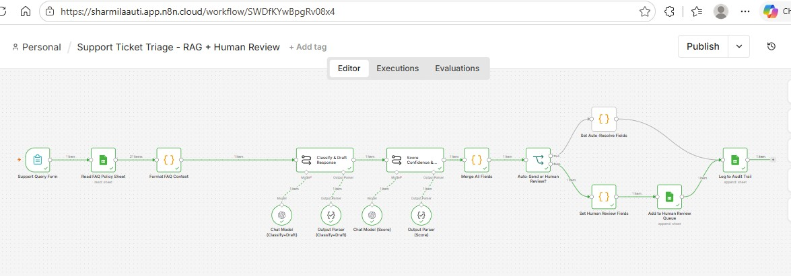

# Compliance Query Triage Agent — Agentic AI Workflow

An end-to-end agentic AI workflow built in **n8n** that classifies incoming banking support queries, drafts policy-grounded responses using RAG, scores confidence and risk using an LLM-as-judge, and routes queries to either auto-resolution or a human review queue — with a full audit trail on every execution.

Built as an AI Product Management portfolio project demonstrating agentic AI, human-in-the-loop governance, and responsible AI design in a regulated context.

---

## Demo

[Watch the 5-minute demo video](#) ← https://www.youtube.com/watch?v=Zht7B7sSi1o



---

## What the Agent Does

```
User submits query (form)
        ↓
Read FAQ Policy Document (Google Sheets)
        ↓
Classify query + Draft grounded response (GPT-4o-mini)
        ↓
Score confidence (1-5) + Flag risk level (LLM-as-judge)
        ↓
Decision Gate (3 conditions must ALL pass)
   ├── confidence >= 3
   ├── risk_flag = low
   └── source_used != none
        ↓                    ↓
  Auto-Resolve          Human Review Queue
  (Audit Log)        (Pending Review + Audit Log)
```

---

## Key Design Principles

- **RAG (Retrieval-Augmented Generation):** The LLM answers only from the FAQ policy document — no hallucination from general knowledge
- **LLM-as-judge:** A second independent LLM call scores the first response for confidence and risk rather than trusting self-reported confidence
- **Hard escalation override:** If no policy source is found (`source_used = none`), the query is escalated regardless of confidence score
- **Full audit trail:** Every execution is logged — query, classification, source cited, confidence score, risk flag, decision, and branch

---

## Tech Stack

| Tool | Purpose |
|---|---|
| n8n | Workflow orchestration |
| GPT-4o-mini (OpenAI API) | LLM reasoning and scoring |
| Google Sheets | Policy knowledge base, Pending Review queue, Audit Log |
| n8n Form Trigger | Query intake |

---

## Performance (12 Test Runs — June 2026)

- Average execution time: **~9 seconds** end-to-end
- Correctly auto-resolved: routine FAQ-grounded queries (account opening, fees, direct deposit)
- Correctly escalated: fraud/identity theft queries, out-of-scope queries, high-risk complaint queries

---

## How to Import and Run

### Prerequisites
- n8n account (cloud or self-hosted)
- OpenAI API key with billing enabled
- Google account with Google Sheets access

### Steps

1. **Import the workflow**
   - In n8n: click Import → select `support-ticket-triage-rag-workflow.json`

2. **Set up Google Sheets**
   - Create a spreadsheet with three sheet tabs:
     - `Customer Banking FAQ Policy Doc` — copy data from the included Excel file (columns: Question, Answer)
     - `Pending Review` — headers: `requestId, receivedAt, query, category, draft_response, source_used, confidence_score, risk_flag, risk_category, reasoning, branch, finalStatus, review_status, reviewer_action, reviewer_notes`
     - `Audit Log` — headers: `requestId, receivedAt, query, category, draft_response, source_used, confidence_score, risk_flag, risk_category, reasoning, branch, finalStatus`

3. **Attach credentials in n8n**
   - OpenAI credential → attach to both Chat Model nodes
   - Google Sheets credential → attach to Read FAQ Policy Sheet, Add to Human Review Queue, Log to Audit Trail nodes
   - Select your spreadsheet and correct sheet tab in each Google Sheets node

4. **Activate and test**
   - Activate the workflow (toggle in n8n)
   - Open the Production URL from the Support Query Form node
   - Submit a query and watch it execute

### Test Queries

| Query | Expected Result |
|---|---|
| `How do I set up direct deposit?` | Auto-resolve |
| `How do I open a savings account?` | Auto-resolve (semantic match) |
| `I want to report suspected money laundering activity on my account and need to speak to your compliance team urgently` | Human review (out of scope + high risk) |
| `What is my interest rate for savings account?` | Human review (not in FAQ) |

---

## Repository Contents

```
compliance-query-triage-agent/
├── support-ticket-triage-rag-workflow.json   # n8n workflow — import this
├── Customer Banking FAQ Policy Document.xlsx  # Knowledge base
├── AI_PM_mini_PRD_completed.pdf              # Product spec and governance design
├── canvas-screenshot.jpg                      # n8n workflow canvas
└── README.md
```

---

## Product Spec (Mini-PRD)

The included PRD covers:
- Problem statement and target users
- Why agentic vs simple chatbot
- MVP scope and known limitations
- Governance and risk controls
- Success metrics (KPIs) with real execution data
- Rollout plan
- What I would do differently at scale

---

## Author

**Sharmila Auti** — AI Product Management  
[LinkedIn](#) ← https://www.linkedin.com/in/sharmila-auti-67b7b3182/
